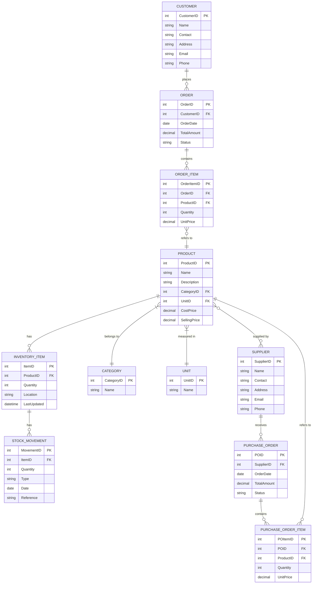
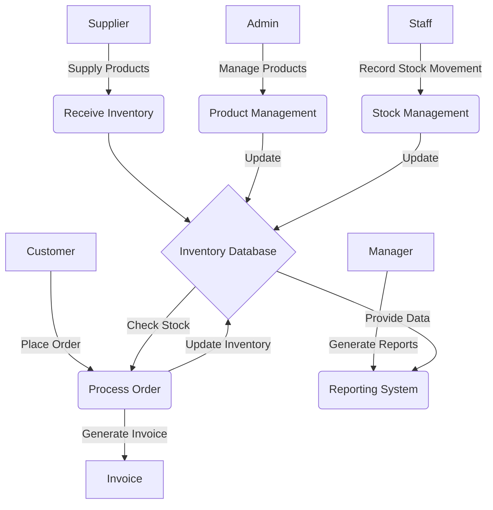

> #prompt 
> Full Detailed Information about Basic `Inventory Management System`. Full details about Inventory App objects/entities with their relational concepts. Full ER Diagram and DFD with Database structure. Explain all related concepts, and important features that must be added to the Web App. Required Database, required or fast and best-supported language to create web app as per 2024 latest technologies.

---

I'd be happy to provide a detailed overview of a basic Inventory Management System, including its key components, relationships, diagrams, and implementation considerations. Let's break this down into several sections:

1. Basic Inventory Management System Overview
2. Key Objects/Entities and Their Relationships
3. ER Diagram
4. Data Flow Diagram (DFD)
5. Database Structure
6. Important Features for the Web App
7. Technology Stack Recommendations

1. Basic Inventory Management System Overview:

An Inventory Management System (IMS) is a software application designed to track, manage, and organize inventory levels, orders, sales, and deliveries. It's crucial for businesses to maintain optimal stock levels, reduce carrying costs, and improve order fulfillment.

2. Key Objects/Entities and Their Relationships:

a) Product
- Attributes: ProductID, Name, Description, Category, Unit, Cost Price, Selling Price
- Relationships: One-to-Many with InventoryItem, Many-to-Many with Supplier

b) InventoryItem
- Attributes: ItemID, ProductID, Quantity, Location, LastUpdated
- Relationships: Many-to-One with Product, One-to-Many with StockMovement

c) Supplier
- Attributes: SupplierID, Name, Contact, Address, Email, Phone
- Relationships: Many-to-Many with Product, One-to-Many with PurchaseOrder

d) Customer
- Attributes: CustomerID, Name, Contact, Address, Email, Phone
- Relationships: One-to-Many with Order

e) Order
- Attributes: OrderID, CustomerID, OrderDate, TotalAmount, Status
- Relationships: Many-to-One with Customer, One-to-Many with OrderItem

f) OrderItem
- Attributes: OrderItemID, OrderID, ProductID, Quantity, UnitPrice
- Relationships: Many-to-One with Order, Many-to-One with Product

g) PurchaseOrder
- Attributes: POID, SupplierID, OrderDate, TotalAmount, Status
- Relationships: Many-to-One with Supplier, One-to-Many with PurchaseOrderItem

h) PurchaseOrderItem
- Attributes: POItemID, POID, ProductID, Quantity, UnitPrice
- Relationships: Many-to-One with PurchaseOrder, Many-to-One with Product

i) StockMovement
- Attributes: MovementID, ItemID, Quantity, Type (In/Out), Date, Reference
- Relationships: Many-to-One with InventoryItem

3. ER Diagram:

This ER diagram illustrates the relationships between the main entities in the Inventory Management System.

4. Data Flow Diagram (DFD):

This DFD shows the main processes and data flows in the Inventory Management System.

5. Database Structure:

Based on the ER diagram, we can create the following database tables:

- Products
- InventoryItems
- Suppliers
- Customers
- Orders
- OrderItems
- PurchaseOrders
- PurchaseOrderItems
- StockMovements
- Categories
- Units

Each table would correspond to an entity in the ER diagram, with foreign keys to represent relationships.

6. Important Features for the Web App:

a) User Authentication and Authorization
b) Dashboard with key metrics (e.g., low stock alerts, top-selling products)
c) Product management (CRUD operations)
d) Inventory tracking and updates
e) Order management (both customer orders and purchase orders)
f) Supplier management
g) Customer management
h) Reporting and analytics (e.g., sales reports, inventory valuation)
i) Barcode scanning for quick product lookup and updates
j) Alerts and notifications (e.g., low stock, order status changes)
k) Integration with accounting software
l) Mobile responsiveness for warehouse use

7. Technology Stack Recommendations (as of 2024):

a) Database:
   - PostgreSQL or MySQL for relational data
   - MongoDB for flexibility with unstructured data

b) Backend:
   - Node.js with Express.js for fast development and good performance
   - Python with Django or FastAPI for robust features and ease of use
   - Go for high performance and efficient resource usage

c) Frontend:
   - React.js or Next.js for building dynamic user interfaces
   - Vue.js for simplicity and ease of integration
   - Svelte for performance and less boilerplate code

d) API:
   - RESTful API or GraphQL for flexible data querying

e) Authentication:
   - JWT (JSON Web Tokens) for stateless authentication
   - OAuth 2.0 for third-party integrations

f) Hosting:
   - Docker containers for consistency across environments
   - Kubernetes for orchestration in larger deployments
   - Cloud platforms like AWS, Google Cloud, or Azure for scalability

g) Additional Tools:
   - Redis for caching and improving performance
   - Elasticsearch for advanced search capabilities
   - WebSockets for real-time updates

The choice of technology stack depends on various factors such as the development team's expertise, project requirements, scalability needs, and budget. As of 2024, JavaScript-based stacks (Node.js + React) are popular for their versatility and large ecosystem. However, Python-based stacks are also widely used for their simplicity and powerful libraries.

For a basic Inventory Management System, a combination of Node.js (Express.js) backend, React frontend, and PostgreSQL database could provide a good balance of performance, developer productivity, and scalability.

Remember to consider factors like security, scalability, and maintainability when implementing your Inventory Management System. Regular updates and user feedback will be crucial for improving the system over time.